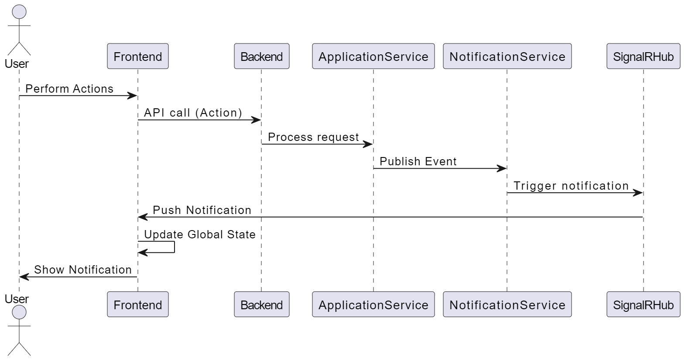

# TourEase
TourEase is a website specifically designed to connect tour guides with travel agencies and travelers, making the process of finding and selecting tours easy and stress-free for all parties involved.

# Phase 1:
## I. Features:

TODO: video demo

- **Authentication & Authorization:** Login, Logout, Register
- **Admin:** Manage destinations (Create, Read, Update, Delete)
- **Travel Agency:** Add, update, and delete tour jobs; select tour guides
- **Tour Guide:** Search for and apply to tour jobs
- **Notifications:** When a tour guide applies for a tour job, the travel agency receives a notification. The agency can then select the tour guide who best matches their qualifications, and that tour guide will receive a notification.

## II. Technologies:
- **Backend:** Microservices with .NET 8, Identity Server, Entity Framework, Dapper, RabbitMQ, gRPC, SignalR, YARP, Serilog, Elasticsearch, AutoMapper, FluentValidator
- **Frontend:** ReactJS, NextJS, Next Auth, Zustand, Tailwind CSS, React Hook Form
- **Database:** PostgreSQL, MongoDB, SQL Server, Redis, MySQL
- **Deployment:** Docker, Kubernetes, CI/CD workflows using GitHub Actions
- **Unit & Integration Testing:** XUnit, Moq

### Architecture

Postman API: https://documenter.getpostman.com/view/6870044/2sAXxPAYHM

### 1. Tour Service (SQL Server + Entity Framework):
- Handles write operations (like creating, updating and deleting tour jobs).
- We use SQL Server to ensure data consistency with strong transactions, which is important for Travel Agencies posting new tours.

### 2. TourSearch Service (MongoDB + MongoDB.Driver):
- Focuses on read operations, as many users will search for tour jobs.
- MongoDB allows faster searches by avoiding complex joins, and it can easily scale out to handle large numbers of users.

#### => Sync Data Between Tour Service (SQL Server) and TourSearch Service (MongoDB):
- Seeding:
	- During seeding, all data first be seeded in SQL Server. The TourSearch Service will then call the Tour Service to retrieve data and insert it into MongoDB
	- If the Tour Service is unavailable, the TourSearch Service will retry until the data is successfully retrieved
- Create, Update, Delete:
	- Data synchronization is handled via RabbitMQ, with the Outbox Pattern implemented to manage scenarios when RabbitMQ is down
	- The TourJobCreatedConsumer will retry 5 times if MongoDB is down
	- When a Destination is Deleted, all its child destinations will also be Deleted. Any TourJobs containing these Destinations will be Updated in both SQL Server and MongoDB

### 3. TourApplication Service (MySQL + Dapper):
#### 3.1 Apply Tour Job (Only Tour Guide Role):
- A TourGuide submits an application after passing role and status checks.
- The status of the application is set to Pending.
- The total number of applicants is updated in both the TourService and TourSearchService.
#### 3.2 Cancel Application (Only Tour Guide Role):
- A TourGuide cancels their Pending application.
- The status of the application is changed to Canceled.
- Both TourService and TourSearchService are updated.
#### 3.3 ReApply Application (Only Tour Guide Role):
- A TourGuide re-applies for a previously canceled application.
- The status of the application is changed back to Pending.
- The total number of applicants is updated again in TourService and TourSearchService.
#### 3.4 Choose Tour Guide (Only Travel Agency Role):
- A TravelAgency selects a TourGuide from the Pending applications.
- The selected application is marked as Accepted, while the others are marked as Rejected.
- Both services update the selected TourGuide and Status for the tour job.
#### 3.5 Background service: Check for expired tour jobs and update their status
- Update IsFinished status in TourApplication Service
- Publish TourJobsExpired event to update TourJob status to Expired in Tour Service and TourSearch Service

### 4. Notification Service (SignalR):
#### Real-time Notification flow:


#### Use Cases:
1. When the travel agency publishes a new tour job, all tour guides will receive a notification.
2. When a tour guide performs application actions (apply, cancel, reapply), the tour job owner (travel agency) will receive a notification.
3. When the tour job owner (travel agency) selects a tour guide, the chosen tour guide will receive a notification.

### 5. Identity Service (Duende IdentityServer + PostgreSQL):
TODO: Draw authentication flow with OAuth2

### 6. Api Gateway (Yarp.ReverseProxy):

### 7. Frontend (ReactJS + NextJS + Next Auth):
#### 7.1 Search TourJobs Behaviors:
- Search by Title or Itinerary
- Filter by Country, City, Duration, Currency, and Include Finished
- Order by End date (default), Recently added, Ascending salary, or Descending salary
- Pagination with the option to select Page Size
- If User wants to select a City, they must select a Country first (all Cities of that Country will be available in the City Options)
- When User inputs a Search Term, Filters will be reset
- When User selects a Country, Search Term will be reset
- Clicking the Logo will reset all Search Term and Filters

#### 7.2 CRUD TourJobs and Destinations UI:
- Create and Update TourJob validation:
	- For VND Currency, salary must not have decimal places.
	- Expired date must be in the future (at least 2 hours).
	- Start date must be after the expired date.
	- End date must be after the start date.
- Create Root Destination: User can select a Parent Destination
- Create Child Destination: The Parent Dropdown is disabled
- Update Destiantion: The Parent Dropdown is hidden

#### 7.3 Frontend Pages:
- Public pages:
	- /tourjobs: Displays tour jobs
	- /tourjobs/[slug]: Displays tour job details that TourGuide Role can apply for (login required)
- Pages only Admin Role:
	- /destinations/list: Displays the destination list, including options create, update, delete destinations
- Pages only TravelAgency Role: 
	- /tourjobs/list : Displays the tour jobs of the agency (My tour jobs)
	- /tourjobs/create: Allows the agency to create a tour job
	- /tourjobs/update/[id]: Allows the agency to update a tour job
	- /tourjobs/[slug]: Displays applicants who has applied, the agency can choose one
- Pages only Tour Guide Role:
	- /tourjobs/[slug]: Displays a button to apply for the tour job
	- /applications: Displays the list of applications the tour guide has submitted. They can Cancel or Reapply for tour jobs
	
### Useful commands:
- Migration commands for Tour API:
```
cd src\Services\Tour
dotnet ef migrations add "Int_TourDB" -p Tour.Infrastructure --startup-project Tour.API --output-dir Persistence/Migrations
dotnet ef migrations remove -p Tour.Infrastructure --startup-project Tour.API
dotnet ef database update -p Tour.Infrastructure --startup-project Tour.API
```

# Phase 2:
- **Tour Guide Networking:** Tour guides can connect with each other by adding friends.
- **Reviews:** Both tour guides and travel agencies can leave reviews for each other.
- **Tour Management for Guides:** Helps tour guides easily organize their calendars and manage their tours.
- **Tour Advertising:** Agencies can promote their tours by pushing notifications to selected tour guides.
- Soft Delete Tour, after 30 days, auto delete
- API Versioning
- Apply Trie to search autocomplete Tour Job
- Upload Image
# Phase 3:
- **Chat Feature:** Allows communication between users.
- **New Role: Traveler:** Introduce a traveler role to the platform.
- **Expanded Tour Properties:** Add more details to tours, such as types (Adventure, History, Buddhism, Culture, etc.), locations (US, UK, Vietnam, etc.), and languages (English, Vietnamese, etc.).
- **Tour Design & Booking:** Tour guides and travel agencies can design tours. Travelers can book individual guides or purchase tours from agencies.
- **Payment Integration:** Allow payments through the platform.
- **Multilingual Support:** Support multiple languages for the website.